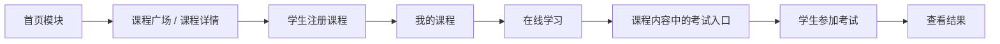
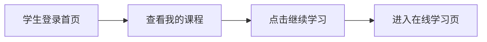
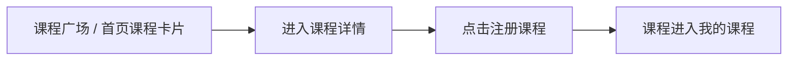
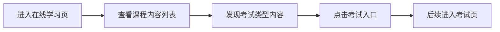

# 学生模块使用文档

## 1. 文档说明

本文档用于帮助组内负责学生模块的同学理解：

- 学生在系统里应该怎么使用功能
- 入口按钮在哪里
- 每一步点击之后会跳到哪里
- 数据会显示在哪些页面
- 当前已经有哪些现成挂点可以直接接

这份文档重点是“如何用”和“如何接”，不要求先看代码。

## 2. 学生模块的作用

学生模块是平台的学习消费端，核心任务是：

- 注册和登录
- 浏览课程
- 注册课程
- 进入我的课程
- 在线学习课程内容
- 后续从课程内容进入考试
- 查看考试结果和学习结果

一句话理解：

**学生模块负责把教师发布出来的课程和考试真正变成学习行为。**

## 3. 学生模块在整体系统中的位置

学生模块与整体系统的关系如下：

## 4. 适用角色

### 4.1 可操作角色

- 学生

### 4.2 不可操作角色

- 游客只能浏览，不能进入学习链
- 教师和管理员不走学生学习流程

## 5. 页面入口

### 5.1 注册页

- 路由：`/register`
- 作用：创建学生账号

### 5.2 登录页

- 路由：`/login`
- 作用：登录进入系统

### 5.3 首页

- 路由：`/index`
- 作用：学生进入学习链的主入口

### 5.4 课程广场

- 路由：`/course-square`
- 作用：浏览课程、搜索课程

### 5.5 课程详情

- 路由：`/course/detail/:courseId`
- 作用：查看课程简介、课程内容、考试内容

### 5.6 我的课程

- 路由：`/learning/my-course`
- 作用：查看自己已注册课程

### 5.7 在线学习

- 路由：`/learning/online`
- 作用：进入课程内容学习页面

### 5.8 我的考试

- 路由：`/learning/exam`
- 作用：后续学生侧考试入口页面

## 6. 学生功能如何使用

### 6.1 注册账号怎么用

操作步骤：

1. 打开注册页
2. 填写：
   - 用户名
   - 密码
   - 学号
   - 手机号
   - 邮箱
   - 学院
   - 专业
3. 提交注册

预期效果：

- 学生账号创建成功
- 可进入登录页登录

数据显示位置：

- 用户表
- 学生档案表

### 6.2 登录系统怎么用

操作步骤：

1. 打开登录页
2. 输入账号和密码
3. 点击登录

预期效果：

- 进入学生首页
- 首页会展示“我的课程”等学习入口

数据显示位置：

- 首页学生模式页面

### 6.3 浏览课程怎么用

操作步骤：

1. 打开首页
2. 点击推荐课程、最新课程，或进入课程广场
3. 在课程广场搜索课程
4. 点击课程卡片

预期效果：

- 进入课程详情页

数据显示位置：

- 首页课程区
- 课程广场课程列表
- 课程详情页

### 6.4 注册课程怎么用

操作步骤：

1. 进入课程详情页
2. 点击注册课程按钮（或后续同类入口）

预期效果：

- 课程进入“我的课程”
- 学生后续可进入学习

数据显示位置：

- 首页“我的课程”区域
- 我的课程页

### 6.5 我的课程怎么用

操作步骤：

1. 学生登录后进入首页
2. 点击顶部导航“我的课程”
3. 或点击首页“继续学习”

预期效果：

- 进入我的课程页
- 查看自己已注册课程

数据显示位置：

- 我的课程页列表

### 6.6 在线学习怎么用

操作步骤：

1. 在我的课程列表中找到课程
2. 点击“继续学习”

预期效果：

- 进入在线学习页
- 显示课程内容列表

数据显示位置：

- 在线学习页

### 6.7 查看课程内容怎么用

在线学习页里，学生后续会看到不同类型的课程内容。

#### 文档

操作方式：

1. 点击文档内容

预期效果：

- 展示正文内容

#### 视频

操作方式：

1. 点击视频内容

预期效果：

- 展示视频资源

#### 图片

操作方式：

1. 点击图片内容

预期效果：

- 展示图片内容

#### 外链

操作方式：

1. 点击外链内容

预期效果：

- 打开外部链接或显示跳转入口

#### 考试

操作方式：

1. 点击考试内容

预期效果：

- 后续进入学生考试页

数据显示位置：

- 在线学习页内容区

## 7. 学生标准操作流程

### 7.1 从首页进入学习

### 7.2 从课程详情进入注册课程

### 7.3 从在线学习进入考试

## 8. 当前已经准备好的学生侧数据

虽然学生模块还需要组内继续开发，但目前教师侧和首页侧已经给学生模块准备好了可以直接用的数据。

### 8.1 我的课程数据

来源：

- `edu_course_enroll`

显示位置：

- 首页“我的课程”
- 我的课程页

### 8.2 在线学习内容数据

来源：

- `edu_course_content`

显示位置：

- 在线学习页
- 课程详情页

### 8.3 考试入口数据

当前考试内容已经具备：

- `contentType = 5`
- `examId`
- `examName`

这意味着学生模块后续可以直接识别：

- 这条内容是不是考试
- 对应哪场考试
- 页面上显示什么考试名称

## 9. 数据会显示在哪里

为了方便组员理解，这里按“数据类型 -> 页面显示位置”来说明。

### 9.1 课程基础信息

会显示在：

- 首页课程卡片
- 课程广场
- 课程详情页
- 我的课程页

### 9.2 课程内容

会显示在：

- 课程详情页
- 在线学习页

### 9.3 考试内容

会显示在：

- 课程详情页的课程内容区
- 在线学习页的内容列表
- 后续学生考试入口页

## 10. 与其他模块的关系

### 10.1 与首页模块

首页负责给学生提供入口：

- 推荐课程
- 最新课程
- 我的课程

学生模块负责继续承接后续学习行为。

### 10.2 与账户模块

学生必须先完成：

- 注册
- 登录

账户模块同时提供学生身份信息和基础资料。

### 10.3 与教师模块

学生模块完全依赖教师模块提供内容：

- 教师发布课程
- 教师发布课程内容
- 教师发布考试并挂到课程内容

### 10.4 与考试模块

学生模块不独立生成考试，而是消费教师侧已经准备好的考试资源。

## 11. 权限边界

学生可以：

- 浏览课程
- 注册课程
- 查看自己的课程
- 学习课程内容
- 后续参加考试

学生不能：

- 管理课程
- 修改课程内容
- 创建题库、试题、试卷、考试
- 查看教师统计页

## 12. 当前仍需继续完成的部分

学生模块当前最需要继续完善的内容包括：

- 真正的学生考试作答页
- 考试提交后结果页
- 待完成 / 已完成任务
- 错题、收藏、笔记、讨论
- 更完整的学习结果沉淀

## 13. 建议的后续开发顺序

对于负责学生模块的同学，建议按以下顺序继续：

1. 我的课程页稳定
2. 在线学习页稳定
3. 课程内容中识别考试入口
4. 学生考试页
5. 成绩结果页
6. 错题 / 收藏 / 笔记 / 讨论

## 14. 总结

学生模块当前虽然还没有全部闭环，但首页和教师模块已经把入口和数据准备好了。  
后续最重要的是把“注册课程 -> 在线学习 -> 进入考试 -> 查看结果”这条主线真正接通。  
只要按本文档中的入口和流程继续往下做，学生侧就能很顺地接上整个项目。 
