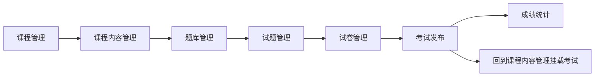

# 教师模块使用文档

## 1. 文档说明

本文档用于帮助组内成员理解教师模块当前能做什么、页面应该怎么点、每个按钮的作用是什么、操作完成后数据会显示在哪个页面，以及教师模块和首页、学生模块、考试模块之间的关系。

即使没有看过代码，也可以通过本文档独立完成教师侧的主要操作。

## 2. 教师模块的作用

教师模块的核心任务是：

- 创建课程
- 维护课程内容
- 创建题库
- 维护试题
- 创建试卷
- 发布考试
- 查看成绩统计
- 将考试挂到课程内容中，供学生端后续进入

一句话理解：

**教师模块是整个平台的内容供给端和教学管理端。**

## 3. 教师模块的整体流程

教师模块当前最重要的一条主线如下：

这条链路的业务意义是：

1. 先有课程
2. 再给课程加内容
3. 再给课程配置考试
4. 后续学生模块通过课程内容进入考试

## 4. 适用角色

### 4.1 可操作角色

- 教师
- 管理员

### 4.2 不可操作角色

- 游客
- 学生

## 5. 权限边界

当前教师模块的权限原则是：

- 教师只管理自己的课程及相关内容
- 教师通过菜单和权限字符串访问课程和考试资源
- 管理员可以在更高权限下查看和管理更多数据

### 5.1 课程相关权限

- `edu:course:list`
- `edu:course:query`
- `edu:course:add`
- `edu:course:edit`
- `edu:course:remove`

### 5.2 内容相关权限

- `edu:content:list`
- `edu:content:query`
- `edu:content:add`
- `edu:content:edit`
- `edu:content:remove`

### 5.3 分类相关权限

- `edu:category:list`

### 5.4 考试链相关权限

- `edu:paper:*`
- `edu:question:*`
- `edu:score:*`

## 6. 页面入口说明

### 6.1 课程管理

- 菜单：`教学管理 -> 课程管理`
- 页面作用：课程的增删改查、发布、预览

### 6.2 课程内容管理

- 入口：课程管理列表中的“内容管理”
- 页面作用：维护某门课的内容
- 说明：这是隐藏页，不单独显示在左侧菜单

### 6.3 题库管理

- 菜单：`教学管理 -> 题库管理`
- 页面作用：维护题库并进入试题管理、试卷管理

### 6.4 试题管理

- 入口：题库管理列表中的“试题管理”
- 页面作用：维护某个题库下的题目

### 6.5 试卷管理

- 入口：
  - 题库管理中的“试卷管理”
  - 试题管理中的“试卷管理”
- 页面作用：维护试卷基础信息

### 6.6 考试发布

- 入口：试卷管理列表中的“发布考试”
- 页面作用：基于试卷创建考试

### 6.7 成绩统计

- 入口：考试发布列表中的“成绩统计”
- 页面作用：查看考试概览和学生成绩记录

## 7. 课程管理怎么用

### 7.1 新增课程

操作步骤：

1. 登录教师账号
2. 打开 `教学管理 -> 课程管理`
3. 点击左上角“新增课程”
4. 在弹窗中填写：
   - 课程名称
   - 所属分类
   - 课程封面
   - 课程副标题
   - 课程简介
   - 课程详情
   - 标签
   - 难度
   - 是否允许注册
   - 发布状态
   - 推荐课程 / 热门课程 / 轮播候选
5. 点击“确定”

预期效果：

- 新课程出现在课程管理列表中
- 如果设置为已发布，后续可在首页、课程广场、课程详情看到

数据显示位置：

- 课程管理列表
- 首页课程区
- 课程广场列表
- 课程详情页

### 7.2 修改课程

操作步骤：

1. 在课程管理页找到目标课程
2. 点击“修改”
3. 更改课程信息
4. 点击“确定”

预期效果：

- 课程列表更新
- 课程详情和首页展示同步更新

数据显示位置：

- 课程管理列表
- 课程详情页
- 首页和课程广场

### 7.3 发布课程 / 下线课程

操作步骤：

1. 在课程管理列表中找到课程
2. 点击对应发布或状态操作

预期效果：

- 已发布课程可被前台展示
- 下线课程不再作为正常展示课程

数据显示位置：

- 课程管理列表状态列
- 首页和课程广场展示结果

### 7.4 预览课程

操作步骤：

1. 在课程管理列表中点击“预览”

预期效果：

- 跳转到课程详情预览页
- 可查看封面、简介、富文本、课程内容和考试内容

数据显示位置：

- 课程详情页

## 8. 课程内容管理怎么用

### 8.1 进入内容管理

操作步骤：

1. 在课程管理列表找到目标课程
2. 点击“内容管理”

预期效果：

- 进入该课程的内容管理页

数据显示位置：

- 课程内容管理页顶部

### 8.2 新增普通内容

操作步骤：

1. 点击“新增内容”
2. 选择内容类型：
   - 文档
   - 视频
   - 图片
   - 外链
3. 填写：
   - 内容标题
   - 摘要
   - 正文
   - 排序
   - 预览开关
   - 发布状态
4. 点击“确定”

预期效果：

- 新内容出现在课程内容列表中
- 如果发布，课程详情页中可看到

数据显示位置：

- 课程内容管理列表
- 课程详情页内容区

### 8.3 新增考试内容

操作步骤：

1. 点击“新增内容”
2. 将内容类型选择为“考试”
3. 页面会出现“关联考试”下拉
4. 从下拉中选择当前课程下已发布考试
5. 点击“确定”

预期效果：

- 课程内容列表中出现一条考试内容
- 该条内容会显示关联考试名称
- 课程详情页中会显示考试入口和考试名称

数据显示位置：

- 课程内容管理列表
- 课程详情页课程内容区
- 后续学生在线学习页课程内容区

### 8.4 修改和删除内容

操作步骤：

1. 在内容列表中点击“修改”或“删除”
2. 修改后点击“确定”
3. 删除时确认删除弹窗

预期效果：

- 内容列表更新
- 课程详情页显示同步变化

## 9. 题库管理怎么用

### 9.1 新增题库

操作步骤：

1. 打开 `教学管理 -> 题库管理`
2. 点击“新增题库”
3. 填写：
   - 题库名称
   - 可见范围
   - 状态
   - 标签
   - 关联课程
   - 备注
4. 点击“确定”

预期效果：

- 题库出现在题库列表中

数据显示位置：

- 题库管理列表

### 9.2 修改题库

操作步骤：

1. 在题库管理列表点击“修改”
2. 更新题库信息
3. 点击“确定”

预期效果：

- 列表更新

数据显示位置：

- 题库管理列表

### 9.3 删除题库

操作步骤：

1. 在题库管理列表点击“删除题库”
2. 确认删除

预期效果：

- 题库从列表中移除

### 9.4 试题管理按钮

操作步骤：

1. 在题库管理列表点击“试题管理”

预期效果：

- 进入当前题库的试题管理页

### 9.5 试卷管理按钮

操作步骤：

1. 在题库管理列表点击“试卷管理”

预期效果：

- 进入当前题库的试卷管理页

## 10. 试题管理怎么用

### 10.1 新增单选题

操作步骤：

1. 进入试题管理页
2. 点击“新增试题”
3. 题型选择“单选题”
4. 填写题干
5. 添加多个选项
6. 勾选一个正确答案
7. 填写解析、分值、难度
8. 点击“确定”

预期效果：

- 单选题出现在试题列表

### 10.2 新增多选题

与单选题类似，不同点是：

- 可以勾选多个正确答案

### 10.3 新增判断题

操作步骤：

1. 题型选择“判断题”
2. 系统会自动带出“正确 / 错误”两个选项
3. 勾选正确答案

预期效果：

- 判断题出现在试题列表

### 10.4 新增填空题

操作步骤：

1. 题型选择“填空题”
2. 填写题干和标准答案
3. 设置解析、分值等

### 10.5 新增简答题

操作步骤：

1. 题型选择“简答题”
2. 填写题干
3. 填写参考答案和解析
4. 设置分值

### 10.6 修改试题

操作步骤：

1. 在试题列表点击“修改”
2. 更新题目内容
3. 点击“确定”

预期效果：

- 正确答案回显正常
- 保存后题目更新

### 10.7 进入试卷管理

操作步骤：

1. 在试题管理页点击“试卷管理”

预期效果：

- 进入当前题库的试卷管理页

## 11. 试卷管理怎么用

### 11.1 新增试卷

操作步骤：

1. 进入试卷管理页
2. 点击“新增试卷”
3. 填写：
   - 试卷名称
   - 所属课程
   - 组卷方式
   - 总分
   - 状态
4. 点击“确定”

预期效果：

- 试卷出现在试卷管理列表

数据显示位置：

- 试卷管理列表

### 11.2 修改试卷

操作步骤：

1. 在试卷管理列表点击“修改”
2. 更新字段
3. 点击“确定”

预期效果：

- 试卷列表更新

### 11.3 删除试卷

操作步骤：

1. 在试卷管理列表点击“删除”
2. 确认删除

### 11.4 发布考试

操作步骤：

1. 在试卷管理列表点击“发布考试”

预期效果：

- 跳转到考试发布页
- 自动带上试卷编号、试卷名称、所属课程、总分等上下文

## 12. 考试发布怎么用

### 12.1 新增考试

操作步骤：

1. 进入考试发布页
2. 点击“新增考试”
3. 填写：
   - 考试名称
   - 开始时间
   - 结束时间
   - 考试时长
   - 及格分
   - 最多作答次数
   - 是否允许中断
   - 中断是否继续计时
   - 是否允许答后看答案
   - 考试说明
4. 点击“确定”

预期效果：

- 考试出现在考试发布列表中
- 该考试可在课程内容中被选择为考试内容

数据显示位置：

- 考试发布列表
- 课程内容管理页的“关联考试”下拉

### 12.2 修改考试

操作步骤：

1. 在考试列表点击“修改”
2. 更新考试配置
3. 点击“确定”

### 12.3 删除考试

操作步骤：

1. 在考试列表点击“删除”
2. 确认删除

### 12.4 进入成绩统计

操作步骤：

1. 在考试发布列表点击“成绩统计”

预期效果：

- 进入当前考试的成绩统计页

## 13. 成绩统计怎么用

### 13.1 查看概览

进入成绩统计页后，页面顶部会显示：

- 应参加人数
- 已提交人数
- 平均分
- 及格率
- 最高分
- 待批阅数量

数据显示位置：

- 成绩统计页概览卡片

### 13.2 筛选成绩记录

操作步骤：

1. 在查询区输入学生账号或姓名
2. 选择作答状态
3. 选择成绩结果
4. 点击“搜索”

预期效果：

- 下方成绩表格刷新

### 13.3 查看成绩记录列表

表格当前会显示：

- 学生账号
- 学生姓名
- 作答状态
- 开始时间
- 提交时间
- 客观题得分
- 主观题得分
- 总分
- 结果

### 13.4 导出成绩

操作步骤：

1. 点击“导出成绩”

当前效果：

- 当前是占位提示，后续可继续完善导出能力

## 14. 教师模块的数据最终会显示在哪里

为了方便不懂代码的组员理解，这里直接用“教师操作 -> 数据显示位置”的方式总结：

### 14.1 新增课程后

数据会显示在：

- 课程管理页
- 首页课程区
- 课程广场
- 课程详情页

### 14.2 新增课程内容后

数据会显示在：

- 课程内容管理页
- 课程详情页
- 后续学生在线学习页

### 14.3 新增考试后

数据会显示在：

- 考试发布页
- 课程内容管理中的“关联考试”下拉
- 课程详情页考试内容区
- 后续学生在线学习页考试入口

### 14.4 成绩统计数据

数据会显示在：

- 成绩统计页概览卡
- 成绩统计页表格

## 15. 与首页模块的关系

教师模块发布的课程会直接影响首页展示结果：

- 推荐课程
- 最新课程
- 课程详情内容
- 课程轮播候选

## 16. 与学生模块的关系

教师模块不是给自己看的，它最终要服务学生端：

- 教师发课程 -> 学生学习
- 教师发考试 -> 学生参加考试
- 教师看统计 -> 了解学生学习和考试结果

## 17. 当前限制与后续增强项

当前仍可继续增强的内容包括：

- 首页运营后台
- 成绩导出
- 主观题批阅
- 更真实的统计字段
- 更复杂的试卷组题能力

## 18. 总结

教师模块当前已经具备完整主骨架，组内成员可以按照本文档独立完成：

- 建课程
- 发内容
- 建题库
- 发考试
- 挂课程
- 看统计

如果后续学生模块继续接上，这条教师主线就能完整支撑整个平台运行。
