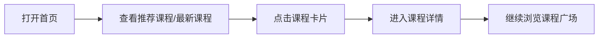
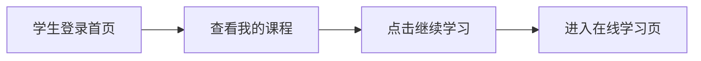
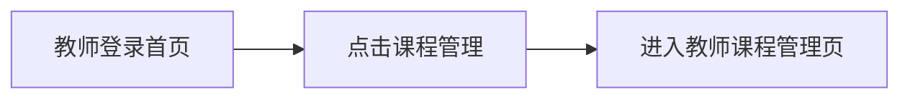

# 首页模块使用文档

## 1. 文档说明

本文档用于帮助组内成员理解首页模块当前已经完成的功能、页面入口、按钮使用方式、显示效果、数据来源及与其他模块的关系。  
即使不了解代码，也可以通过本文档快速知道首页应该怎么用、每个按钮点了之后会发生什么、数据会展示在哪里。

## 2. 首页模块的作用

首页模块是整个平台的门户页，主要负责：

- 向游客展示平台和课程资源
- 向学生提供学习入口
- 向教师和管理员提供教学入口
- 展示推荐课程、最新课程和重点课程
- 提供课程搜索入口
- 连接课程广场和课程详情页

一句话理解：

**首页模块是整个平台的统一入口和课程展示页。**

## 3. 适用角色

### 3.1 游客

游客可以：

- 打开首页
- 查看推荐课程和最新课程
- 使用搜索框跳转课程广场
- 查看课程详情

游客不能：

- 注册课程
- 进入我的课程
- 使用教师管理功能

### 3.2 学生

学生登录后首页会切换成学习导向模式，主要展示：

- 我的课程
- 继续学习
- 推荐课程
- 最新课程

### 3.3 教师 / 管理员

教师和管理员当前共用同一套教学导向首页，主要展示：

- 课程管理入口
- 课程展示入口
- 推荐课程
- 最新课程

## 4. 页面入口

### 4.1 首页

- 路由：`/index`
- 页面位置：登录后默认进入

### 4.2 课程广场

- 路由：`/course-square`
- 页面作用：按分类和关键词查看课程列表

### 4.3 课程详情

- 路由：`/course/detail/:courseId`
- 页面作用：查看课程完整信息和课程内容

## 5. 当前已实现的主要区域

首页目前主要由以下部分组成：

1. 顶部导航栏
2. Hero 主视觉区域
3. 搜索和快捷入口区域
4. 课程轮播区
5. 推荐课程 / 我的课程区
6. 最新课程区
7. 课程变化提示条

## 6. 首页每个功能如何使用

### 6.1 顶部导航怎么用

顶部导航当前提供这些入口：

- 首页
- 课程广场
- 我的课程（学生）
- 课程管理（教师 / 管理员）

操作方式：

1. 打开首页
2. 点击顶部导航中的对应文字按钮

预期效果：

- 点击“首页”：回到首页
- 点击“课程广场”：进入课程广场
- 点击“我的课程”：学生进入自己的课程列表
- 点击“课程管理”：教师进入课程管理页

数据显示位置：

- 页面顶部导航栏

### 6.2 Hero 主按钮怎么用

Hero 区当前有主按钮和副按钮。

学生模式常见按钮：

- 查看课程广场
- 我的学习

教师 / 管理员模式常见按钮：

- 查看课程广场
- 课程管理

操作方式：

1. 进入首页
2. 点击 Hero 中的主按钮或副按钮

预期效果：

- 跳转到课程广场、我的学习或课程管理

数据显示位置：

- 首页 Hero 主视觉区左侧

### 6.3 首页搜索框怎么用

操作方式：

1. 在首页搜索框输入课程关键词
2. 点击“搜索课程”
3. 或直接按回车

预期效果：

- 页面跳转到课程广场
- 搜索关键词自动带入课程广场
- 课程广场自动执行查询

数据显示位置：

- 首页搜索框区域
- 课程广场顶部搜索栏
- 课程广场课程列表

### 6.4 课程轮播图怎么用

操作方式：

1. 打开首页
2. 查看 Hero 下方的课程轮播区
3. 点击轮播图中的课程按钮或课程标题

预期效果：

- 跳转到对应课程详情页

数据显示位置：

- 首页轮播图区域
- 课程详情页

### 6.5 推荐课程怎么用

操作方式：

1. 在首页找到推荐课程区域
2. 点击课程卡片

预期效果：

- 进入对应课程详情页

数据显示位置：

- 首页推荐课程区
- 课程详情页

### 6.6 最新课程怎么用

操作方式：

1. 在首页找到最新课程区域
2. 点击课程卡片

预期效果：

- 进入对应课程详情页

数据显示位置：

- 首页最新课程区
- 课程详情页

### 6.7 我的课程怎么用（学生）

操作方式：

1. 学生登录后进入首页
2. 在“我的课程”区域找到课程
3. 点击课程卡片或“继续学习”

预期效果：

- 跳转到后续学习页
- 查看自己已注册课程的内容

数据显示位置：

- 首页“我的课程”区域
- 在线学习页

### 6.8 课程变化提示怎么用

操作方式：

1. 第一次打开首页
2. 浏览一遍首页课程内容
3. 后续课程发生变化后重新刷新首页

预期效果：

- 顶部会出现变化提示条
- 部分新增课程卡片会显示“新”标记

数据显示位置：

- 首页提示条区域
- 课程卡片右上角

## 7. 首页标准使用流程

### 7.1 游客浏览流程

### 7.2 学生使用流程

### 7.3 教师使用流程

## 8. 首页数据从哪里来

首页当前依赖的数据主要来自以下表：

- `edu_course`：课程主表
- `edu_course_content`：课程内容表
- `edu_course_enroll`：学生注册课程关系表
- `edu_course_banner`：轮播图表
- `edu_course_category`：课程分类表

### 8.1 推荐课程显示在哪里

推荐课程主要显示在：

- 首页推荐课程区
- 首页轮播区（后续根据运营策略决定）

### 8.2 最新课程显示在哪里

最新课程主要显示在：

- 首页最新课程区

### 8.3 我的课程显示在哪里

我的课程主要显示在：

- 学生首页“我的课程”区域

## 9. 首页和其他模块的关系

### 9.1 与账户模块

账户模块决定首页显示什么角色入口：

- 游客看到游客视图
- 学生看到学习视图
- 教师 / 管理员看到教学视图

### 9.2 与教师模块

教师模块负责提供首页所展示的课程数据。  
教师新增和发布课程后，课程才有机会出现在首页。

### 9.3 与学生模块

首页负责把学生送到：

- 课程广场
- 课程详情
- 我的课程
- 在线学习

### 9.4 与考试模块

首页不直接让教师管理考试，但课程详情中会展示课程里的考试内容，后续学生可从中进入考试。

## 10. 权限与边界

### 10.1 游客

- 只能浏览
- 不能编辑、注册、进入教师页面

### 10.2 学生

- 可以学习和注册课程
- 不能管理课程

### 10.3 教师

- 可通过首页进入教师模块
- 不通过首页直接做课程编辑，而是跳转到教师模块

## 11. 当前限制与后续可增强项

当前首页已经较完整，但后续仍可增强：

- 管理员首页独立化
- 推荐课程和轮播图的后台运营页
- 更真实的热门课程规则
- 与学生考试结果展示更深的联动

## 12. 给组员的建议

### 12.1 负责首页的同学

重点关注：

- 课程展示是否正确
- 搜索是否能正确跳到课程广场
- 首页和课程详情是否一致

### 12.2 负责教师模块的同学

重点关注：

- 教师发布的课程是否能出现在首页
- 推荐 / 热门 / 轮播候选字段是否影响首页展示

### 12.3 负责学生模块的同学

重点关注：

- 学生如何从首页进入我的课程
- 学生如何通过首页进入课程学习和后续考试

## 13. 总结

首页模块当前已经是一个完整的课程门户入口。  
它的主要任务不是管理数据，而是把课程展示清楚、把不同角色送到正确功能入口，并作为课程与学习链路的起点。
